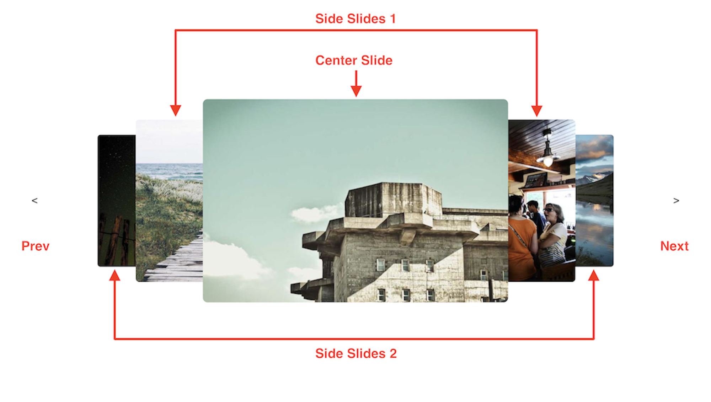

# React Twitch Slider

Create sliders just like Twitch home page slider in seconds!

## How to Use?

Oh, it's easy. First install it using your favorite package manager:

```bash
npm install react-twitch-slider
```

Then use it like this:

```jsx
import TwitchSlider from "react-twitch-slider"

function App() {
  return (
    <TwitchSlider slideHeight="40vh" slideWidth="60vh">
      
      ...
      
    </TwitchSlider>
  )
}
```

The only required props are `slideHeight` and `slideWidth`. They both accept `number` and `string` values. Numbers for pixel values and strings for values like `600px`, `30rem`, or `40vw` or any other css values.

## Customizations

Before getting into customizing the look of the slider, take a look at the following picture, we use these names to refer to the slides:



The following section includes the props you can pass to `TwitchSLider` component.

#### `autoPlay: boolean;` (Default: `true`)

#### `centerSlideClassName: string;` (Optional)

#### `initialCenterSlideIndex: number;` (Default: `0`)

#### `interval: number;` (Default: `5` seconds)

#### `nextButtonClassName?: string;` (Optional)

#### `nextButtonContent: React.ReactNode;` (Default: `">>"`)

#### `pauseOnHover: false | 'centerSlide' | 'allSlides' | 'wrapper';` (Default: `"centerSlide"`)

#### `prevButtonClassName?: string;` (Optional)

#### `prevButtonContent: React.ReactNode;` (Default: `"<<"`)

#### `side1SlidesClassName: string;` (Optional)

#### `side1SlidesScale: string;` (Default: `"0.8"`)

#### `side1SlidesTranslateX: string;` (Default: `"40%"`)

#### `side2SlidesClassName: string;` (Optional)

#### `side2SlidesScale: string;` (Default: `"0.65"`)

#### `side2SlidesTranslateX: string;` (Default: `"80%"`)

#### `slideHeight: number | string;`

#### `slideWidth: number | string;`
